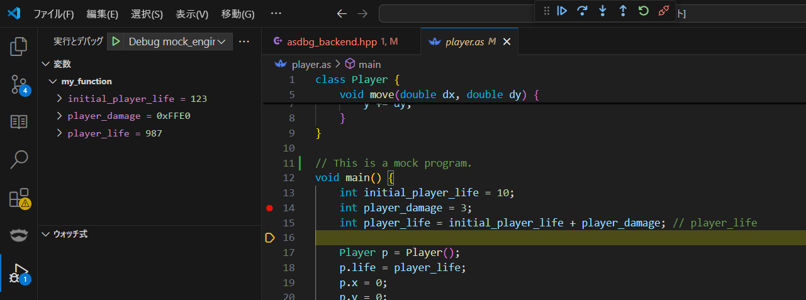

# AngelScript Debugger for VSCode

This experimental project is based on [vscode-mock-debug](https://github.com/microsoft/vscode-mock-debug)

# Currently Implemented

- Run the mock engine and hit breakpoints set in script files
- Display values of placeholder variables
- Support for Step Over, Continue

# How to debug

1. From **Run and Debug** in VSCode, select **Extension + Server**. This will open the `mock_game` directory in a new window.

2. Build `mock_engine.cpp` using the following command:
   `g++ mock_engine.cpp -static-libstdc++ -static-libgcc -lws2_32 -g -o mock_engine.exe`
   Alternatively, press `Ctrl + Shift + B.`

3. Open any `*.as` file and set breakpoints where needed.

4. Run the program:
   `./mock_engine.exe`

# TODO
- Support execution in actual AngelScript
- Display variable values correctly
- Properly implement features like Step In

# Goal
- Embed into the Language Server
- Provide a user-friendly, header-only library `asdbg_backend.hpp` for easy integration
  - Ideally support C++11 or C++14 and make it compatible with any platform
